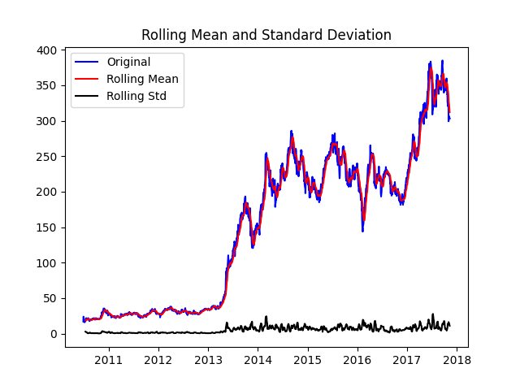
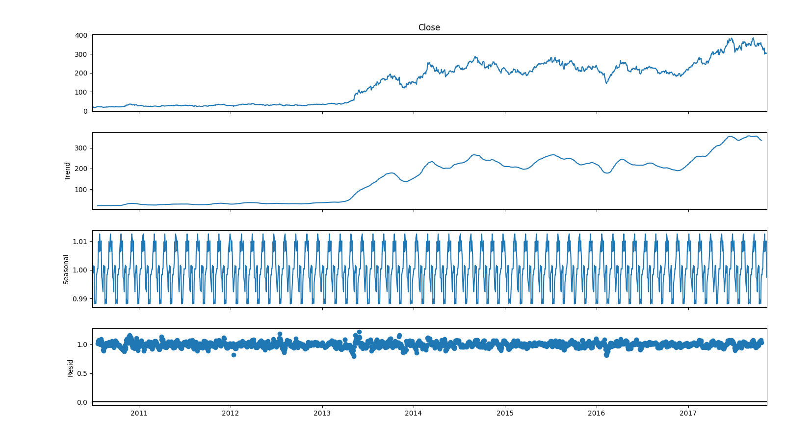
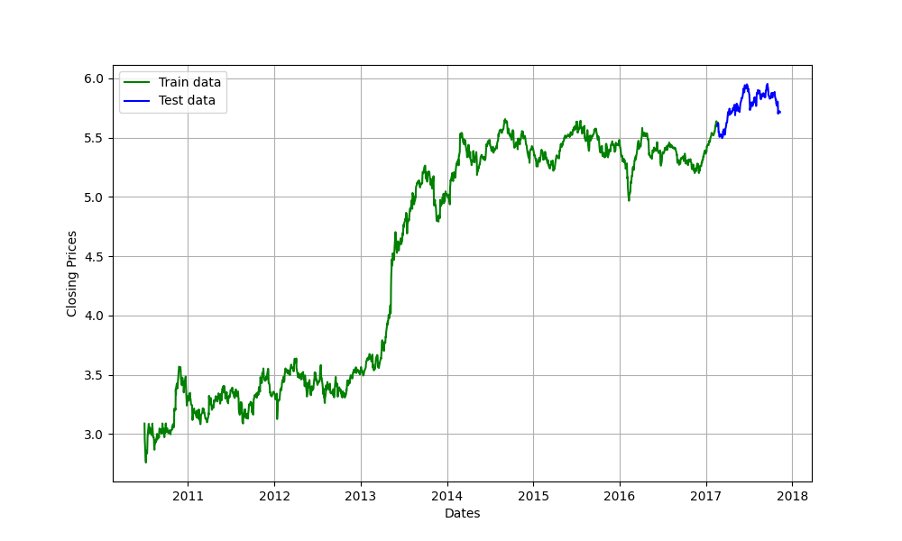
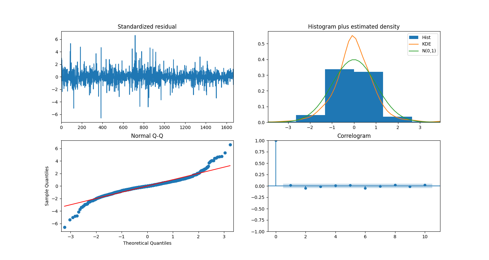
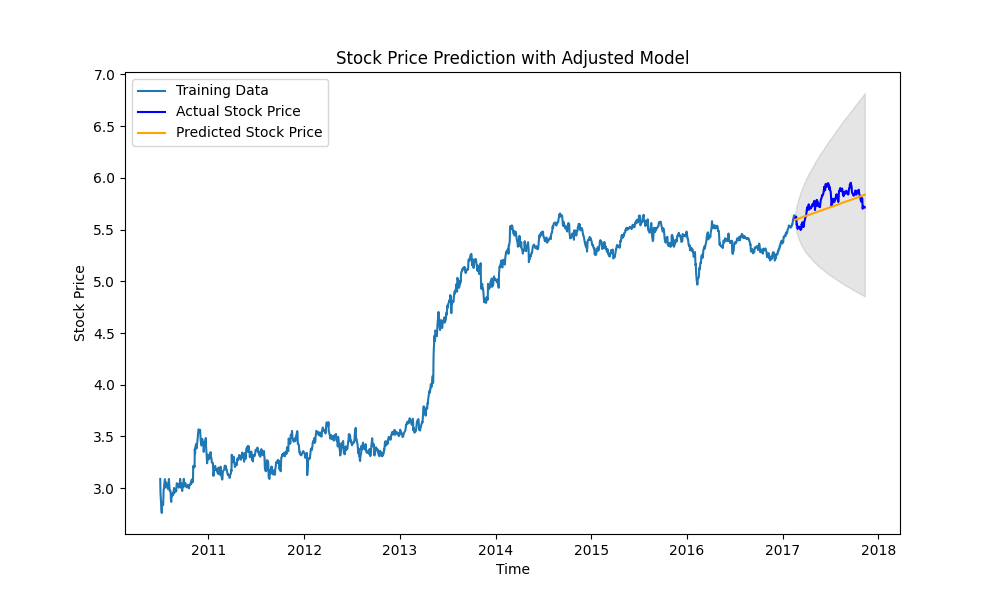
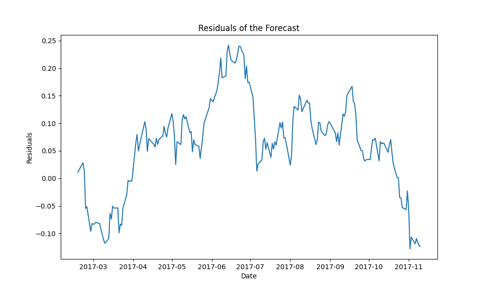
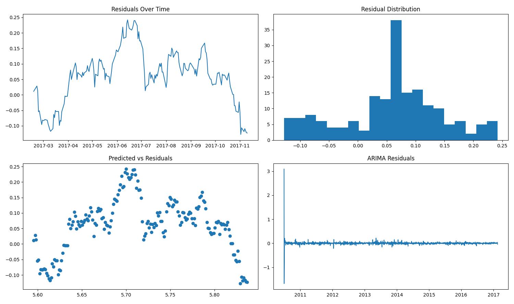

# Predikcia ceny akcií Tesla pomocou ARIMA a MSE

V tejto úlohe predikujeme cenu akcií spoločnosti Tesla (TSLA) pomocou modelu ARIMA (AutoRegressive Integrated Moving Average). Vyhodnotíme výkonnosť modelu pomocou strednej kvadratickej chyby (Mean Squared Error - MSE) a analyzujeme rezíduá.

## 1. Načítanie a predspracovanie dát

Najprv načítame dáta o cenách akcií Tesla a zameriame sa na uzatváraciu cenu (`Close`). 

```python

data = pd.read_csv("tsla.us.txt", index_col="Date", parse_dates=True)
data_close = data["Close"]
```

## 2. Testovanie stacionarity dát
Pred aplikovaním ARIMA modelu musíme zabezpečiť, že dáta sú stacionárne. Použijeme Dickey-Fullerov test na kontrolu stacionarity a zároveň vykreslíme kĺzavý priemer a štandardnú odchýlku.

```python
def test_stationarity(timeseries):
    rolmean = timeseries.rolling(12).mean()
    rolstd = timeseries.rolling(12).std()
    plt.plot(timeseries, color="blue", label="Original")
    plt.plot(rolmean, color="red", label="Rolling Mean")
    plt.plot(rolstd, color="black", label="Rolling Std")
    plt.legend(loc="best")
    plt.title("Rolling Mean and Standard Deviation")
    plt.show()
    print("Results of Dickey-Fuller Test")

    adft = adfuller(timeseries, autolag="AIC")
    output = pd.Series(
        adft[0:4],
        index=[
            "Test Statistics",
            "p-value",
            "No. of lags used",
            "Number of observations used",
        ],
    )
    for key, values in adft[4].items():
        output["critical value (%s)" % key] = values
    print(output)
```    

```    
Results of Dickey-Fuller Test
Test Statistics                  -0.842866
p-value                           0.806205
No. of lags used                  1.000000
Number of observations used    1856.000000
critical value (1%)              -3.433878
critical value (5%)              -2.863099
critical value (10%)             -2.567600
```
# Spustenie testu stacionarity
```python
test_stationarity(data_close)
```
## 3. Rozklad časovej rady
Rozložíme časovú radu na trend, sezónnosť a rezíduá pomocou dekompozície. Tým získame lepší prehľad o jednotlivých komponentoch časovej rady.

```python
result = seasonal_decompose(data_close, model="multiplicative", period=30)
fig = plt.figure()
fig = result.plot()
fig.set_size_inches(16, 9)
plt.show()
```


## 4. Odstránenie trendu a aplikácia logaritmickej transformácie
Aby sme odstránili trend z dát, použijeme logaritmickú transformáciu a následne vykreslíme kĺzavý priemer a štandardnú odchýlku.

```python
rcParams["figure.figsize"] = 10, 6
df_log = np.log(data_close)
moving_avg = df_log.rolling(12).mean()
std_dev = df_log.rolling(12).std()
plt.legend(loc="best")
plt.title("Moving Average")
plt.plot(std_dev, color="black", label="Standard Deviation")
plt.plot(moving_avg, color="red", label="Mean")
plt.legend()
plt.show()
```


## 5. Rozdelenie dát na trénovacie a testovacie sety
Dáta rozdelíme na trénovacie a testovacie sety, pričom 90% dát použijeme na trénovanie a 10% na testovanie.

```python
train_data, test_data = (
    df_log[3 : int(len(df_log) * 0.9)],
    df_log[int(len(df_log) * 0.9) :],
)
plt.figure(figsize=(10, 6))
plt.grid(True)
plt.xlabel("Dates")
plt.ylabel("Closing Prices")
plt.plot(train_data, "green", label="Train data")
plt.plot(test_data, "blue", label="Test data")
plt.legend()
plt.show()
```



## 6. Automatický výber parametrov pre ARIMA pomocou Auto ARIMA
Použijeme funkciu auto_arima na automatické určenie najlepších parametrov pre model ARIMA na základe trénovacích dát.

```python
model_autoARIMA = pm.auto_arima(
    train_data,
    start_p=0,
    start_q=0,
    test="adf",  
    max_p=3,
    max_q=3,  
    m=1,  
    d=None,  
    seasonal=False,  
    start_P=0,
    D=0,
    trace=True,
    error_action="ignore",
    suppress_warnings=True,
    stepwise=True,
)
print(model_autoARIMA.summary())
```
```
SARIMAX Results
==============================================================================
Dep. Variable:                      y   No. Observations:                 1669
Model:               SARIMAX(0, 1, 0)   Log Likelihood                3334.226
Date:                Wed, 21 Aug 2024   AIC                          -6664.451
Time:                        12:42:19   BIC                          -6653.612
Sample:                             0   HQIC                         -6660.435
                               - 1669
Covariance Type:                  opg
==============================================================================
                 coef    std err          z      P>|z|      [0.025      0.975]
------------------------------------------------------------------------------
intercept      0.0015      0.001      1.869      0.062   -7.29e-05       0.003
sigma2         0.0011   1.85e-05     58.233      0.000       0.001       0.001
===================================================================================
Ljung-Box (L1) (Q):                   0.34   Jarque-Bera (JB):              2632.60
Prob(Q):                              0.56   Prob(JB):                         0.00
Heteroskedasticity (H):               0.43   Skew:                             0.13
Prob(H) (two-sided):                  0.00   Kurtosis:                         9.15
===================================================================================
```
```python
model_autoARIMA.plot_diagnostics(figsize=(15, 8))
plt.show()
```



## 7. Trénovanie ARIMA modelu s upravenými parametrami
Na základe výsledkov z auto_arima upravíme parametre modelu a znova ho natrénujeme. Potom predikujeme ceny akcií na základe testovacích dát.

```python
model = ARIMA(train_data, order=(1, 2, 2))  
fitted = model.fit()

forecast_object = fitted.get_forecast(steps=len(test_data))
fc = forecast_object.predicted_mean
conf = forecast_object.conf_int()

fc.index = test_data.index
conf.index = test_data.index


plt.figure(figsize=(10, 6))
plt.plot(train_data, label="Training Data")
plt.plot(test_data, color="blue", label="Actual Stock Price")
plt.plot(fc, color="orange", label="Predicted Stock Price")
plt.fill_between(fc.index, conf.iloc[:, 0], conf.iloc[:, 1], color="k", alpha=0.1)
plt.title("Stock Price Prediction")
plt.xlabel("Time")
plt.ylabel("Stock Price")
plt.legend(loc="upper left")
plt.show()
```



8. Vyhodnotenie modelu pomocou MSE a analýza rezíduí
Na vyhodnotenie modelu vypočítame strednú kvadratickú chybu (MSE) a analyzujeme rezíduá, aby sme identifikovali potenciálne nedostatky modelu.

```python
mse = mean_squared_error(test_data, fc)
print(f"Mean Squared Error: {mse}")
```
```
Mean Squared Error: 0.011125971605201944
```

```python
residuals = test_data - fc

plt.figure(figsize=(10, 6))
plt.plot(residuals)
plt.title("Residuals of the Forecast")
plt.xlabel("Date")
plt.ylabel("Residuals")
plt.show()
```

```python
plt.figure(figsize=(10, 6))
plt.hist(residuals, bins=20)
plt.title("Distribution of Residuals")
plt.xlabel("Residual")
plt.ylabel("Frequency")
plt.show()
```

```python

plt.figure(figsize=(15, 8))
plt.subplot(221)
plt.plot(residuals)
plt.title("Residuals Over Time")
plt.subplot(222)
plt.hist(residuals, bins=20)
plt.title("Residual Distribution")
plt.subplot(223)
plt.scatter(fc, residuals)
plt.title("Predicted vs Residuals")
plt.subplot(224)
plt.plot(fitted.resid)
plt.title("ARIMA Residuals")
plt.tight_layout()
plt.show()
```


# Záver
Vyhodnotili sme model pomocou MSE a analyzovali sme rezíduá na identifikovanie potenciálnych problémov v predikcii. Aj keď má model jasné nedostatky a nedoporučil by som ho nikomu kto chce vložiť na burzu peniaze, predikoval cenu s dobrou presnosťou a nebol vôbec ďaleko. Je trochu optimista, no v realite v roku 2024, mu to vyšlo (dáta sú len do 2017). 
